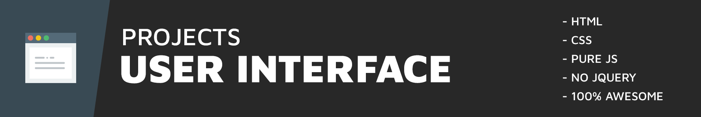
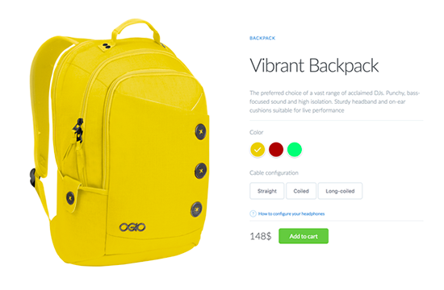

# UI Projects

I'm excited to share with you some of my insights, works, and experimental things that I like to do with User Interface.

Check out the full [CodePen collection here](http://codepen.io/collection/DNzmyZ/).

## Days
<table>
    <thead>
        <tr>
            <th>Day</th>
            <th>Preview</th>
            <th>Description</th>
            <th>Blog</th>
        </tr>
    </thead>
    <tbody>
        <tr>
            <td><strong>001</strong></td>
            <td></img></td>
            <td>Product Color Switch</td>
            <td align="center"><a href="https://fullstackreact.com/react-daily-ui/001-sign-up-form/" target="_blank">:white_check_mark: :arrow_right:</a></td>
        </tr>
    </tbody>
</table>

