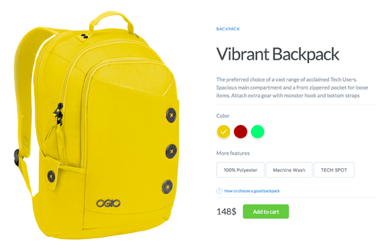

# UI Projects

I'm excited to share with you some of my insights, works, and experimental things that I like to do with User Interface.

Check out the full [CodePen collection here](http://codepen.io/collection/DNzmyZ/).

## Days
<table>
    <thead>
        <tr>
            <th>Nº</th>
            <th>Preview</th>
            <th>Description</th>
            <th>Live</th>
        </tr>
    </thead>
    <tbody>
        <tr>
            <td><strong>001</strong></td>
            <td></img></td>
            <td>Product Color Switch</td>
            <td align="center"><a href="https://codepen.io/MichaelAlves/full/zwvxoQ/" target="_blank">:white_check_mark: :arrow_right:</a></td>
        </tr>
        <tr>
            <td><strong>002</strong></td>
            <td></img></td>
            <td>Slider Morph</td>
            <td align="center"><a href="https://codepen.io/MichaelAlves/full/KmzZXv/" target="_blank">:white_check_mark: :arrow_right:</a></td>
        </tr>
        <tr>
            <td><strong>003</strong></td>
            <td></img></td>
            <td>Pure Reactive UI</td>
            <td align="center">
                <a href="https://github.com/suforoso/pure-reactive-ui" target="_blank">:octocat:</a>
                <a href="https://pure-reactive-ui.firebaseapp.com/" target="_blank">:earth_americas:</a>
            </td>
        </tr>
    </tbody>
</table>

